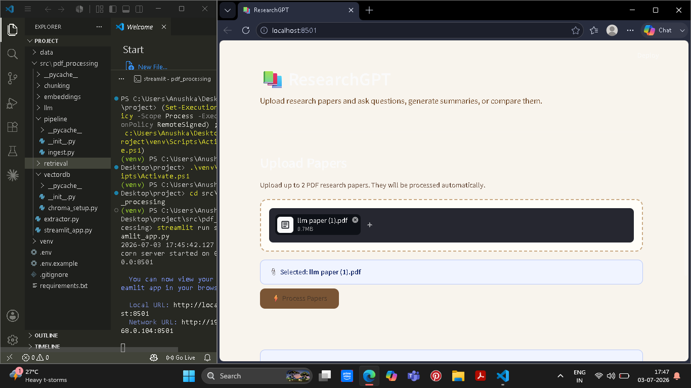
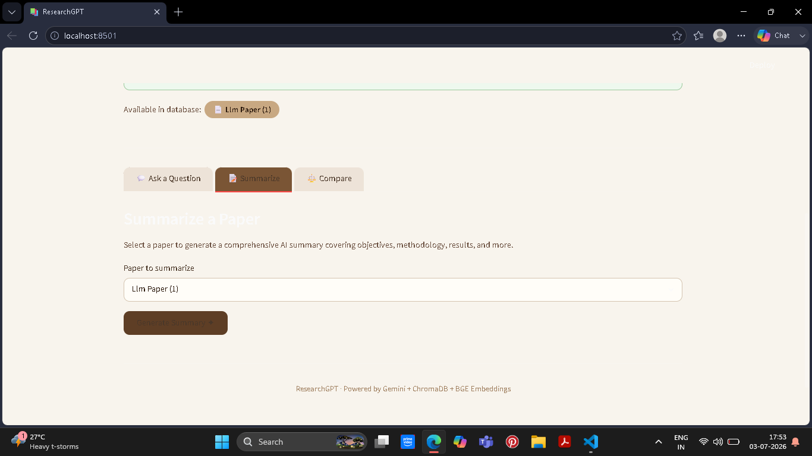
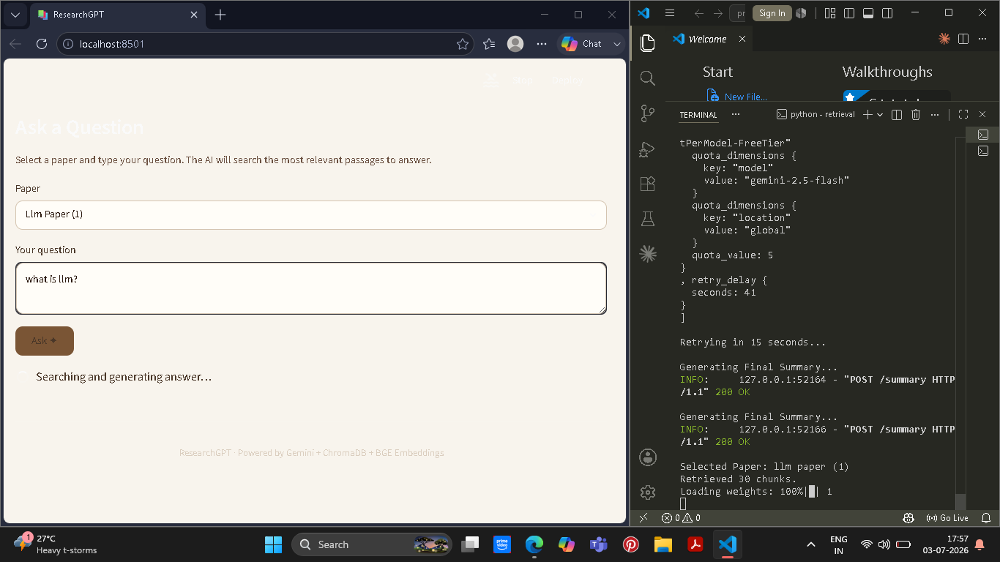
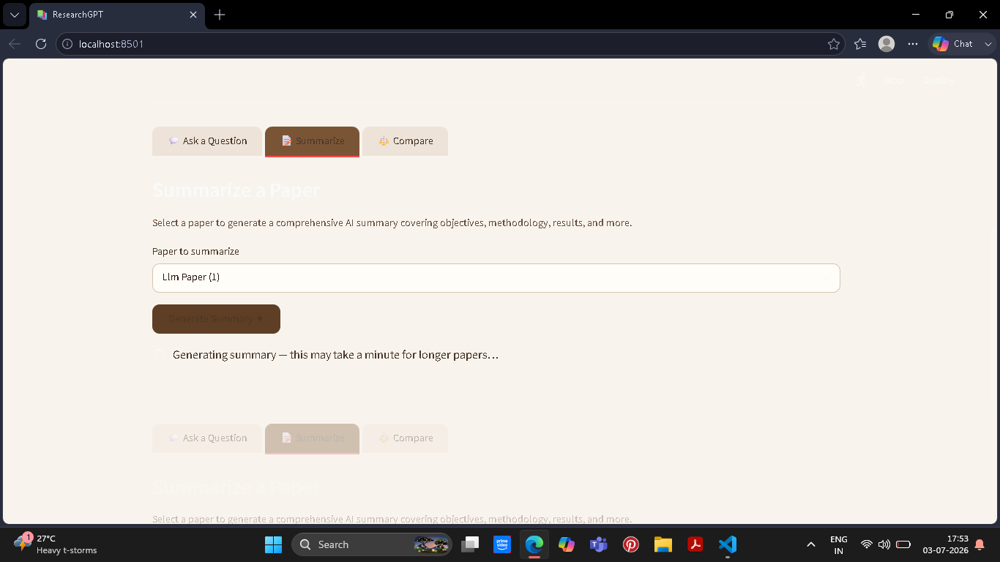
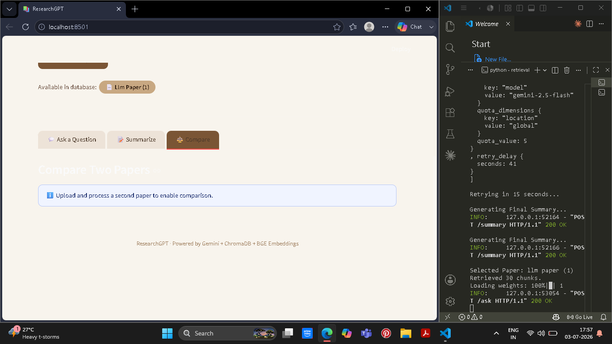
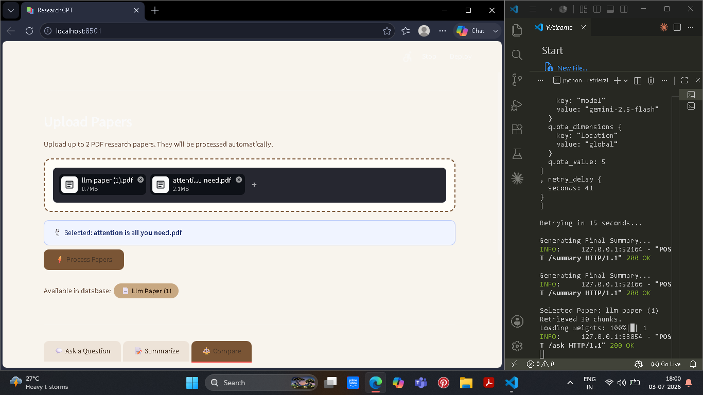
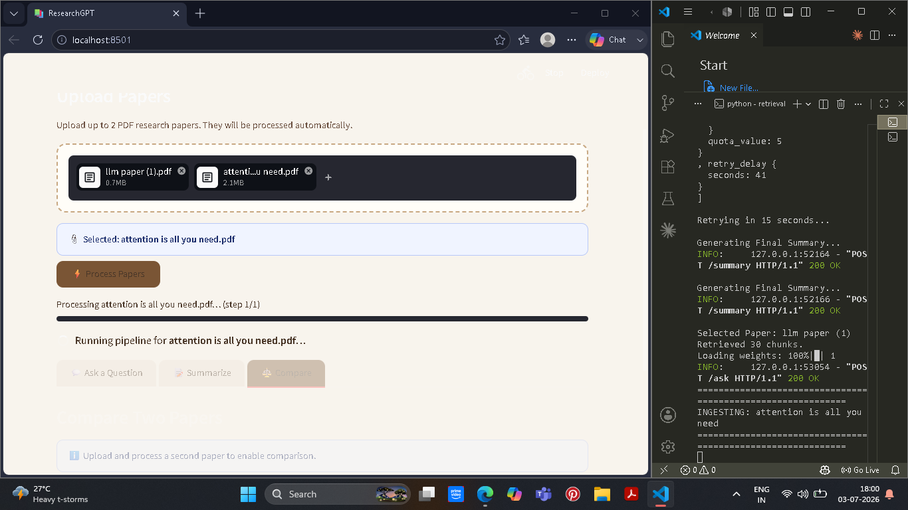
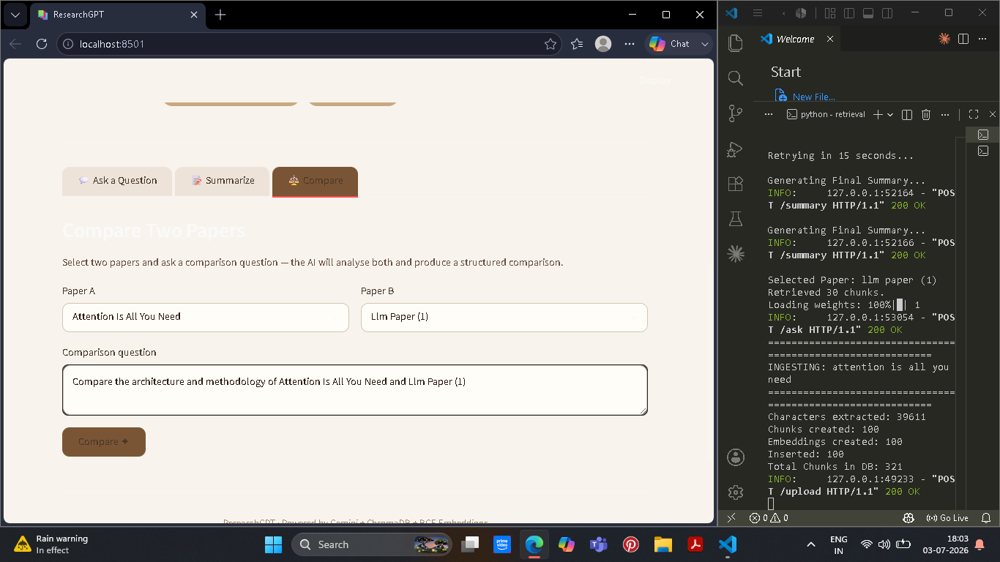

# 📚 PaperInsight

<p align="center">

AI-Powered Research Paper Assistant built using **Retrieval-Augmented Generation (RAG)**, **ChromaDB**, **CrossEncoder Re-ranking**, **Google Gemini**, **FastAPI**, and **Streamlit**.

</p>

<p align="center">


</p>

---

# 📖 Overview

PaperInsight is an intelligent Research Paper Assistant that helps users understand research papers through natural language interaction.

Instead of manually reading long academic papers, users can upload one or more research papers and perform tasks such as:

- ❓ Ask questions
- 📝 Generate concise summaries
- ⚖️ Compare two research papers
- 🔍 Retrieve relevant sections using semantic search

The application uses a Retrieval-Augmented Generation (RAG) pipeline to retrieve the most relevant information before generating responses with Google's Gemini Large Language Model.

---

# 🎯 Motivation

Reading research papers is often time-consuming and difficult due to their length and technical complexity.

PaperInsight was developed to make research papers easier to understand by combining semantic retrieval with Large Language Models.

The project focuses on generating grounded responses using retrieved information rather than relying solely on the LLM's internal knowledge, thereby reducing hallucinations and improving answer reliability.

---

# ✨ Features

## 📖 Question Answering

Upload a research paper and ask questions in natural language.

Example:

> What is the main contribution of this paper?

The system retrieves the most relevant sections before generating an answer.

---

## 📝 Research Paper Summarization

Generate structured summaries including:

- Research Objective
- Methodology
- Key Contributions
- Results
- Conclusion

This helps users understand lengthy research papers within seconds.

---

## ⚖️ Compare Two Research Papers

Upload two research papers and compare them across multiple aspects:

- Problem Statement
- Research Objective
- Methodology
- Models Used
- Dataset
- Experimental Results
- Advantages
- Limitations
- Future Scope

Useful for literature reviews and research analysis.

---

## 🔍 Semantic Search

Instead of keyword matching, PaperInsight performs semantic similarity search using dense vector embeddings.

This allows the system to retrieve relevant information even when different wording is used.

---

## 🎯 CrossEncoder Re-ranking

Retrieved chunks are reranked using a CrossEncoder model to improve retrieval quality before being sent to the LLM.

This significantly improves answer relevance.

---

# 🏗 System Architecture

```

                    User

                      │

                      ▼

            Streamlit Frontend

                      │

                      ▼

              FastAPI Backend

                      │

        ┌─────────────┴─────────────┐

        │                           │

        ▼                           ▼

 Question Answering          Summarization

        │                           │

        └─────────────┬─────────────┘

                      │

               Query Embedding

                      │

                      ▼

          ChromaDB Vector Database

                      │

                      ▼

          Top-k Semantic Retrieval

                      │

                      ▼

          CrossEncoder Re-ranking

                      │

                      ▼

              Google Gemini LLM

                      │

                      ▼

              Final AI Response

```

---

# ⚙️ How PaperInsight Works

## Step 1 — Upload Papers

The user uploads one or more research papers in PDF format through the Streamlit interface.

---

## Step 2 — PDF Processing

The uploaded PDFs are processed using **PyMuPDF**, extracting clean textual content while preserving the document structure.

---

## Step 3 — Intelligent Chunking

Large documents are divided into manageable semantic chunks.

Chunking improves retrieval efficiency and ensures the language model receives focused context instead of the entire document.

---

## Step 4 — Embedding Generation

Each chunk is converted into dense vector embeddings using:

**BAAI/bge-small-en-v1.5**

These embeddings capture semantic meaning rather than simple keyword occurrences.

---

## Step 5 — Vector Storage

The generated embeddings are stored inside **ChromaDB**, enabling fast semantic similarity search.

---

## Step 6 — User Query

When the user asks a question, the query is embedded using the same embedding model.

---

## Step 7 — Semantic Retrieval

ChromaDB retrieves the most semantically relevant chunks from the stored research papers.

---

## Step 8 — Re-ranking

A CrossEncoder model reranks the retrieved chunks to identify the most relevant context.

This improves retrieval precision and overall answer quality.

---

## Step 9 — Response Generation

The reranked context is passed to Google's Gemini LLM.

Gemini generates a context-aware response grounded in the retrieved information.

---

## Step 10 — Final Output

The final answer is displayed to the user through the Streamlit interface.

---

# 📂 Project Structure

```

PaperInsight/

│

├── data/

│ ├── uploads/

│ ├── extracted/

│ ├── chunks/

│ ├── embeddings/

│ └── chroma_db/

│

├── src/

│ └── pdf_processing/

│ ├── chunking/

│ ├── embeddings/

│ ├── retrieval/

│ ├── vectordb/

│ ├── pipeline/

│ ├── streamlit_app.py

│ └── extractor.py

│

├── requirements.txt

├── README.md

├── .env.example

└── .gitignore

```

---

# 🛠 Technology Stack

| Category | Technology |
|----------|------------|
| Language | Python |
| Frontend | Streamlit |
| Backend | FastAPI |
| Embeddings | BAAI BGE |
| Vector Database | ChromaDB |
| Re-ranking | CrossEncoder |
| LLM | Google Gemini |
| PDF Processing | PyMuPDF |

---

# 🚀 Installation

Clone the repository

```bash
git clone https://github.com/yourusername/PaperInsight.git

cd PaperInsight
```

Create virtual environment

```bash
python -m venv venv
```

Activate

Windows

```bash
venv\Scripts\activate
```

Install dependencies

```bash
pip install -r requirements.txt
```

---

# 🔑 Environment Variables

Create a `.env` file

```
GOOGLE_API_KEY=YOUR_API_KEY
```

---

# ▶ Running the Project

Start FastAPI

```bash
uvicorn app:app --reload
```

Run Streamlit

```bash
streamlit run streamlit_app.py
```

---

# 📷 Screenshots
## 🏠 Home Page




---

## ❓ Question Answering



---

## 📝 Summarization




---

## ⚖️ Compare Papers







# 📄 License

This project is licensed under the MIT License.

---


